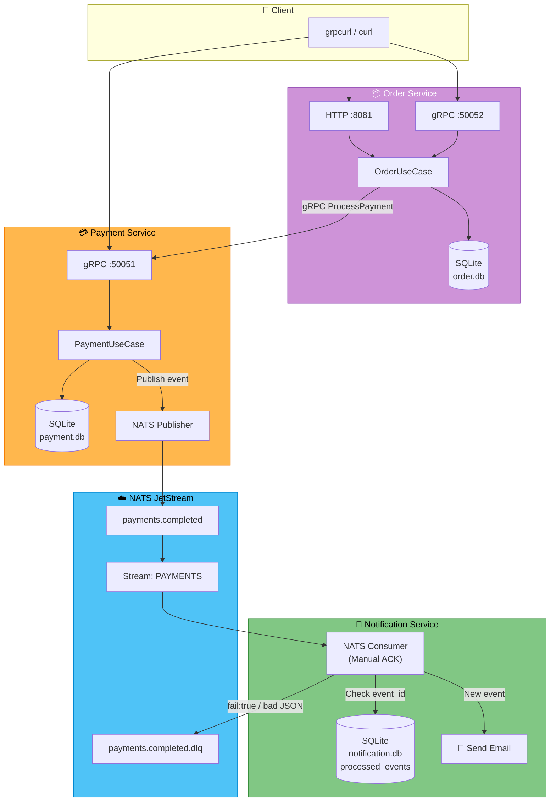
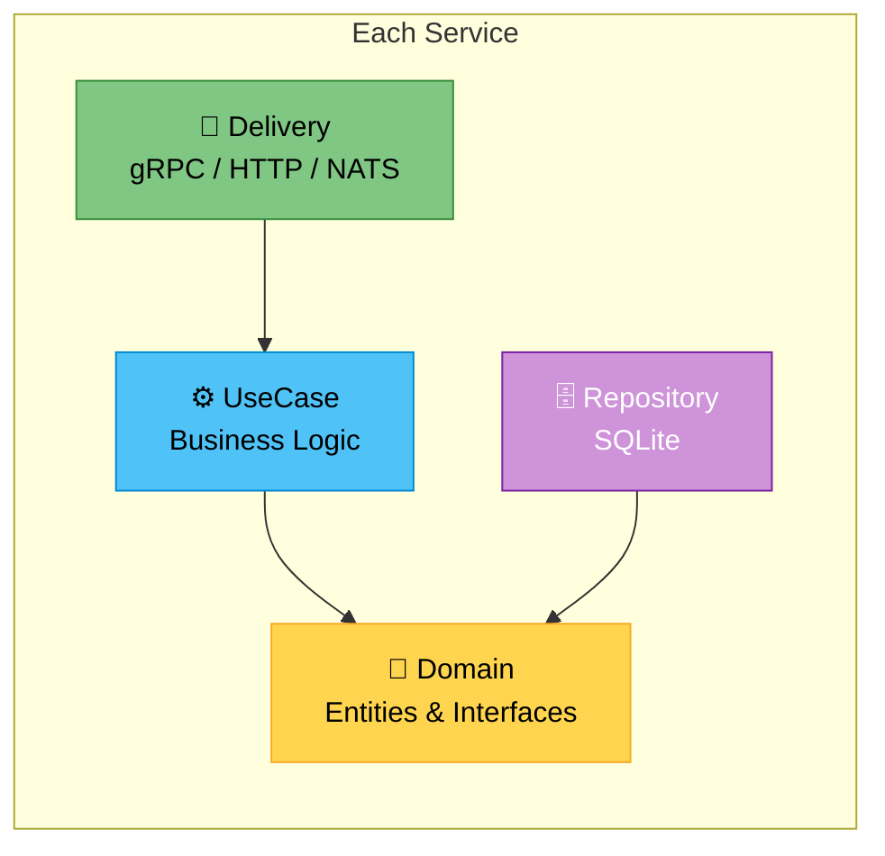
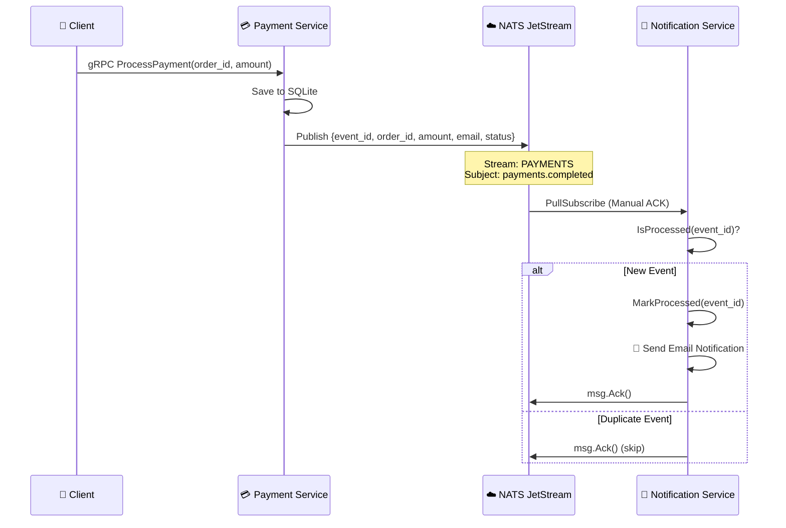
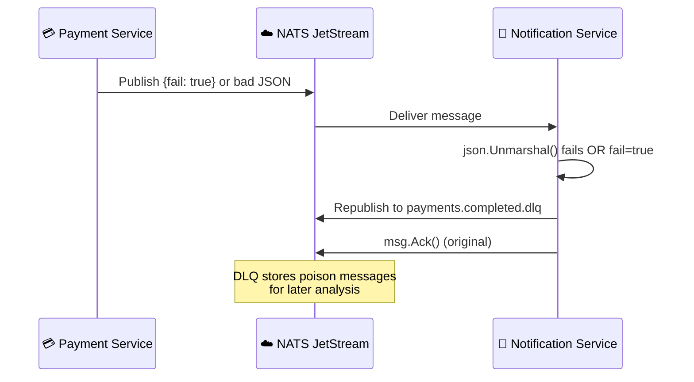
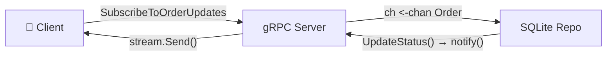
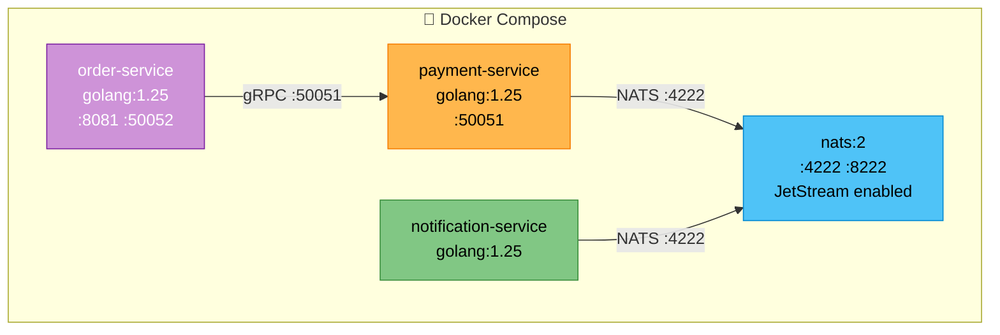

# AP2 — Assignment 2+3: Order & Payment Microservices (gRPC + EDA)

## Project Overview

Three isolated Go microservices communicating via **gRPC** and **NATS JetStream**:

| Service | Transport | Port(s) | Database |
|---------|-----------|---------|----------|
| **Order Service** | HTTP (Gin) + gRPC | HTTP `8081`, gRPC `50052` | SQLite `order.db` |
| **Payment Service** | gRPC + NATS Publisher | gRPC `50051` | SQLite `payment.db` |
| **Notification Service** | NATS Consumer only | — | SQLite `notification.db` |

---

## System Architecture



---

## Clean Architecture



```
internal/
├── domain/         # Entities, DTOs, ports (interfaces), domain errors
├── usecase/        # Business logic and orchestration
├── repository/     # SQLite persistence + auto-migrations
└── delivery/
    ├── http/       # Gin REST layer (Order Service only)
    ├── grpc/       # gRPC server implementation
    └── nats/       # NATS publisher / consumer
```

Dependencies flow inward: `delivery → usecase → domain ← repository`

---

## Event-Driven Architecture (Assignment 3)

### EDA Flow



### DLQ Flow (Poison Messages)



### Key Concepts

| Concept | Implementation |
|---------|---------------|
| **At-Least-Once Delivery** | JetStream pull consumer with `ManualAck()` |
| **Idempotency** | `processed_events(event_id PK)` — duplicates are ACKed and skipped |
| **DLQ** | Bad JSON or `fail:true` → republish to `payments.completed.dlq` |
| **Decoupling** | Payment does not know about Notification — they only share NATS subjects |

### DLQ Simulation

If `order_id` starts with `"dlq-"`, the publisher sets `fail:true` in the event. The consumer sees the flag and sends the message to the DLQ instead of processing it.

---

## Remote Proto Repositories

| Repository | Purpose |
|------------|---------|
| [assignment2-protos](https://github.com/AQADIL/assignment2-protos) | `.proto` source definitions |
| [assignment2-generated](https://github.com/AQADIL/assignment2-generated) | Generated Go code (`*.pb.go` + `*_grpc.pb.go`) |

```go
import pb "github.com/AQADIL/assignment2-generated/order"
import pb "github.com/AQADIL/assignment2-generated/payment"
```

---

## Order Service

### gRPC RPCs (port 50052)

| RPC | Request | Response | Description |
|-----|---------|----------|-------------|
| `CreateOrder` | `CreateOrderRequest` | `OrderResponse` | Create order, call Payment Service via gRPC |
| `GetOrder` | `GetOrderRequest` | `OrderResponse` | Get order by ID |
| `CancelOrder` | `CancelOrderRequest` | `OrderResponse` | Cancel a Pending order |
| `ListOrdersByCustomer` | `ListOrdersRequest` | `ListOrdersResponse` | List all orders for a customer |
| `SubscribeToOrderUpdates` | `OrderFilter` | `stream OrderResponse` | **Server-streaming** real-time order updates |

### HTTP REST Endpoints (port 8081)

| Method | Path | Description |
|--------|------|-------------|
| `POST` | `/orders` | Create order (with `Idempotency-Key` header) |
| `GET` | `/orders/:id` | Get order by ID |
| `GET` | `/orders?customer_id=xxx` | List orders by customer |
| `PATCH` | `/orders/:id/cancel` | Cancel order |

### Real-Time Streaming



### Idempotency (HTTP only)

Order creation via HTTP supports idempotency via the `Idempotency-Key` header:
- Middleware checks `idempotency_keys` table using `INSERT OR IGNORE`.
- If key exists, the stored `(status_code, response_body)` is replayed.

---

## Payment Service

### gRPC RPCs (port 50051)

| RPC | Request | Response | Description |
|-----|---------|----------|-------------|
| `ProcessPayment` | `PaymentRequest` | `PaymentResponse` | Authorize or decline a payment |
| `GetPaymentByOrderId` | `GetPaymentRequest` | `Payment` | Get payment by order ID |
| `ListPayments` | `ListPaymentsRequest` | `ListPaymentsResponse` | List payments by amount range |

### Business Rule

If `amount > 100000` → status `Declined`, else `Authorized`.

### Logging Interceptor

A **gRPC UnaryServerInterceptor** logs every RPC call with method name, duration, and error.

### Error Handling

| Domain Error | gRPC Code |
|-------------|-----------|
| `ErrOrderNotFound` / `ErrPaymentNotFound` | `codes.NotFound` |
| `ErrInvalidAmount` | `codes.InvalidArgument` |
| `ErrCannotCancelOrder` | `codes.FailedPrecondition` |
| `ErrPaymentUnavailable` | `codes.Unavailable` |
| `ErrInvalidRange` | `codes.InvalidArgument` |
| Internal errors | `codes.Internal` |

---

## Docker Compose



---

## Environment Variables

| Variable | Service | Default | Description |
|----------|---------|---------|-------------|
| `ORDER_DB` | Order | `./order.db` | SQLite database path |
| `PAYMENT_GRPC_ADDR` | Order | `localhost:50051` | Payment Service gRPC address |
| `HTTP_PORT` | Order | `8080` | HTTP server port |
| `GRPC_PORT` | Order | `50052` | gRPC server port |
| `PAYMENT_DB` | Payment | `./payment.db` | SQLite database path |
| `GRPC_PORT` | Payment | `50051` | gRPC server port |
| `NATS_URL` | Payment, Notification | `nats://localhost:4222` | NATS server address |
| `NOTIFICATION_DB` | Notification | `./notification.db` | SQLite database path |

---

## Running

### Docker Compose (recommended)

```bash
docker compose up -d --build
docker compose logs -f
```

### Locally (three terminals)

```bash
# Terminal 1 — Payment Service
make run-payment

# Terminal 2 — Order Service
make run-order

# Terminal 3 — Notification Service
cd notification-service && go run ./cmd/main.go
```

---

## Testing with grpcurl

### Payment Service (port 50051)

```bash
# Create a payment → publishes event to NATS
grpcurl -plaintext -d '{"order_id":"test-1","amount":5000}' localhost:50051 payment.PaymentService/ProcessPayment

# Get payment by order ID
grpcurl -plaintext -d '{"order_id":"test-1"}' localhost:50051 payment.PaymentService/GetPaymentByOrderId

# List payments by amount range (0 = no limit)
grpcurl -plaintext -d '{"min_amount":1000,"max_amount":50000}' localhost:50051 payment.PaymentService/ListPayments
```

### Order Service (gRPC port 50052)

```bash
# Create an order
grpcurl -plaintext -d '{"customer_id":"alice","item_name":"Laptop","amount":50000}' localhost:50052 order.OrderService/CreateOrder

# Get an order
grpcurl -plaintext -d '{"order_id":"<UUID>"}' localhost:50052 order.OrderService/GetOrder

# List orders by customer
grpcurl -plaintext -d '{"customer_id":"alice"}' localhost:50052 order.OrderService/ListOrdersByCustomer

# Subscribe to real-time updates (streams)
grpcurl -plaintext -d '{"customer_id":"alice"}' localhost:50052 order.OrderService/SubscribeToOrderUpdates
```

### Order Service (HTTP port 8081)

```bash
# Create order
curl -X POST http://localhost:8081/orders -H "Content-Type: application/json" -d '{"customer_id":"alice","item_name":"Phone","amount":30000}'

# List orders
curl http://localhost:8081/orders?customer_id=alice

# Get order
curl http://localhost:8081/orders/<id>

# Cancel order
curl -X PATCH http://localhost:8081/orders/<id>/cancel
```

### EDA / Notification Verification

```bash
# 1. Create a payment (triggers NATS event)
grpcurl -plaintext -d '{"order_id":"normal-1","amount":5000}' localhost:50051 payment.PaymentService/ProcessPayment

# 2. Check notification logs — should see email sent
docker logs ap2_assignment1-notification-service-1

# 3. DLQ simulation — order_id starting with "dlq-" triggers fail=true
grpcurl -plaintext -d '{"order_id":"dlq-test1","amount":5000}' localhost:50051 payment.PaymentService/ProcessPayment

# 4. Check notification logs — should NOT see email for dlq-test1
docker logs ap2_assignment1-notification-service-1
```

---

## Build

```bash
make build
```

## Clean

```bash
make clean
```
